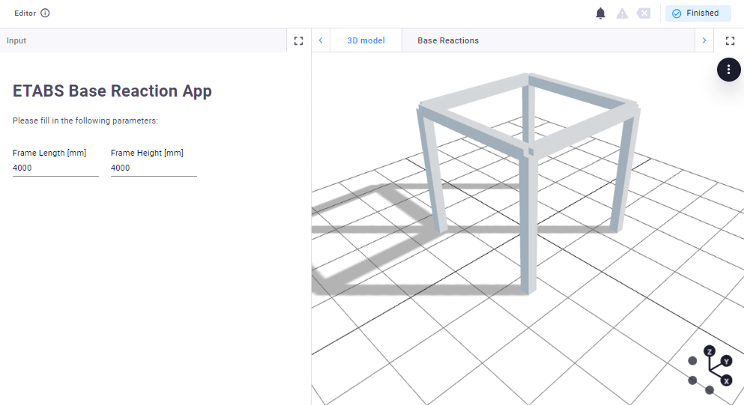
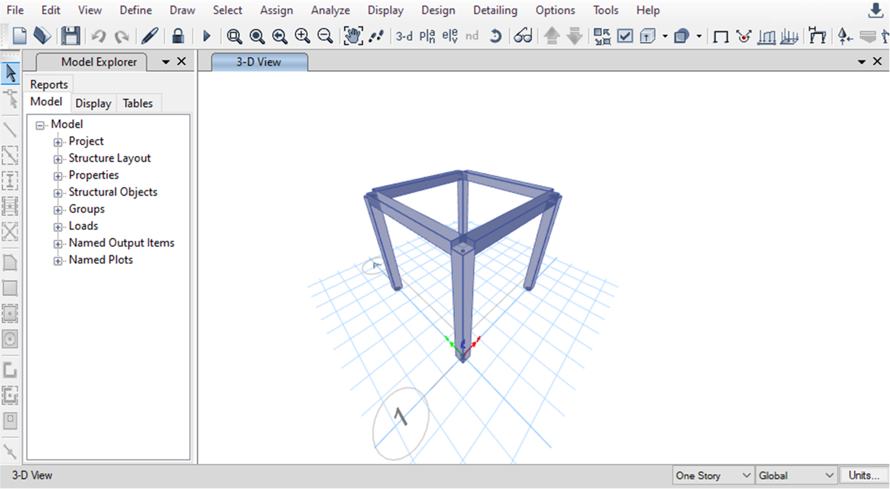
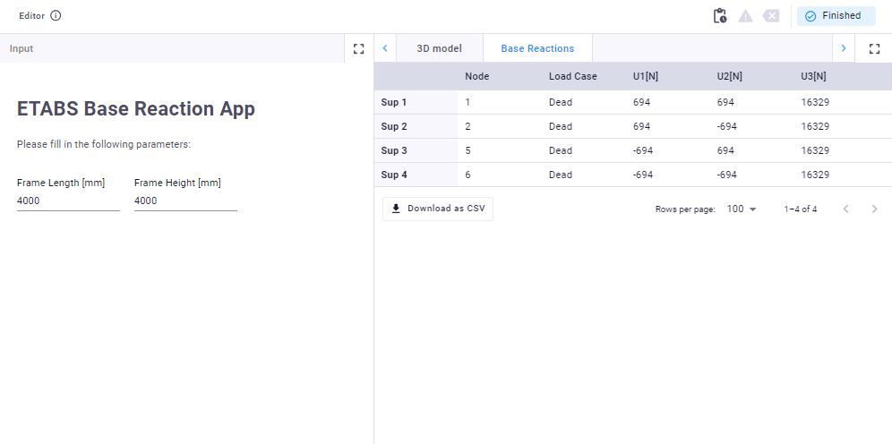

# ETABS Concrete Frame
This app creates a 3D concrete frame by defining two parameters: frame length and height. The model is created in ETABS using the CSI API, then analyzed under the default load case (Dead Load/Self Weight), and the reactions are sent back to the app for visualization in a table view.

## ETABS Connection
The connection between VIKTOR and SAP2000 or ETABS is managed by a “worker.” A worker is a program that connects the VIKTOR platform to third-party software running outside the platform. You can install the worker on your local machine to test the integration by following this [tutorial](https://docs.viktor.ai/docs/create-apps/software-integrations/etabs-and-sap2000/). The API will create a model as shown below:

## Table View
The VIKTOR app post-processes the results from ETABS and displays them in a `TableView`. The results are the reaction loads calculated by ETABS under the self-weight of the structure, as shown in the image below.

## References
Feel free to check the following [tutorial](https://docs.viktor.ai/docs/tutorials/integrations/etabs-sap2000-tutorial/) and [guide](https://docs.viktor.ai/docs/create-apps/software-integrations/etabs-and-sap2000/) to set up the app and worker correctly!
