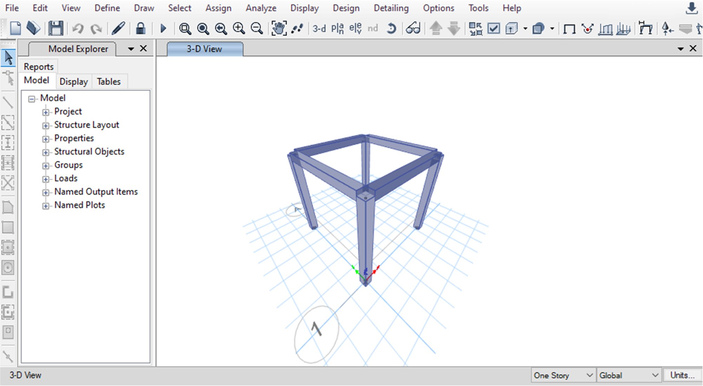
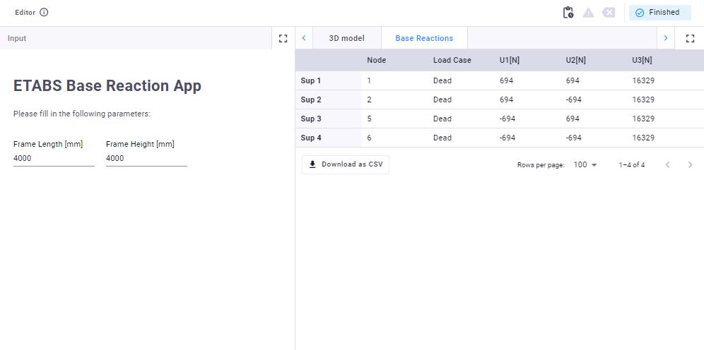
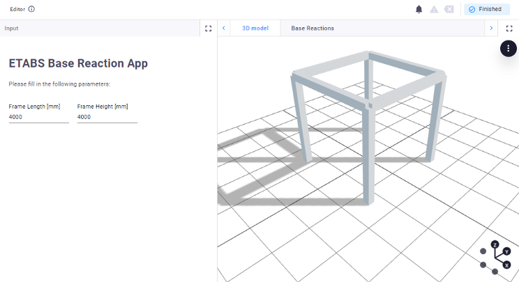

# ETABS Concrete Frame
This app creates a 3D concrete frame by defining two parameters: frame length and height. The model is created in ETABS using the CSI API, then analyzed under the default load case (Dead Load/Self Weight), and the reactions are sent back to the app for visualization in a table view.



## ETABS Connection
The connection between VIKTOR and SAP2000/ETABS is managed by a “worker”. A worker connects the VIKTOR platform to third-party software running outside the platform.



## Table View
The VIKTOR app post-processes the results from ETABS and displays them in a `TableView`. The results are the reaction loads calculated by ETABS under the self-weight of the structure, as shown in the image below.



## References
Feel free to check the following [tutorial](https://docs.viktor.ai/docs/tutorials/integrations/etabs-sap2000-tutorial/) and [guide](https://docs.viktor.ai/docs/create-apps/software-integrations/etabs-and-sap2000/) to set up the app and worker correctly!

## Worker flow (local ETABS)
The worker must run on the Windows machine where ETABS is installed.
Start the app:
```bash
viktor-cli install
viktor-cli start
```
Then, in the web app, follow the worker setup:
1. Download the ETABS worker.
2. Paste the token shown in the setup.
3. Select a Python executable (on Windows, find it with `where python`).
4. Install ETABS control deps into that exact Python environment:
```bash
C:\Path\To\python.exe -m pip install comtypes pywin32
```
After that, change parameters in the app and run the analysis/update view to trigger the worker.

## Tips
- Run ETABS + the worker with the same permissions (often both “Run as administrator”) if you hit COM/permission errors.
- If the worker can’t connect, re-check the selected Python path and that `comtypes`/`pywin32` were installed into that same environment.
- Ensure ETABS opens without modal pop-ups (license dialogs, update prompts), since they can block automation.
